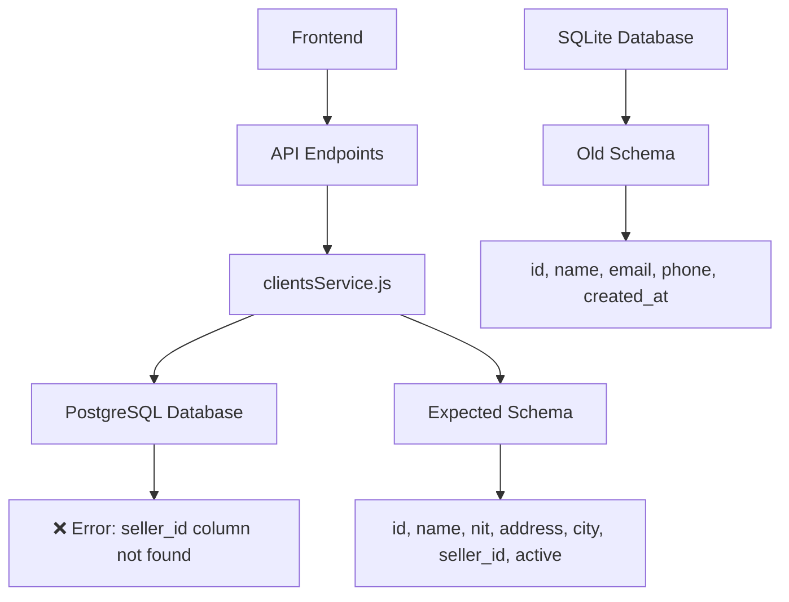
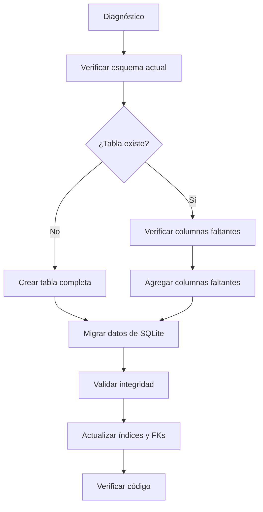

# Design Document: Fix Clients Table Schema

## Overview

Este diseño aborda el problema crítico donde la tabla `clients` en PostgreSQL no tiene la estructura correcta que el código espera. El código en `clientsService.js` intenta acceder a columnas que no existen (`seller_id`, `nit`, `address`, `city`, `active`), causando errores en múltiples funcionalidades del sistema.

## Architecture

### Current State Analysis



**Problema identificado:**
- Código refactorizado para PostgreSQL espera 7 columnas
- Tabla actual en PostgreSQL tiene estructura incompleta o diferente
- Migración de SQLite no transfirió/transformó datos correctamente

### Solution Architecture



## Components and Interfaces

### 1. Schema Diagnostic Component

**Responsabilidad:** Verificar el estado actual del esquema de la tabla `clients`.

```javascript
class SchemaDiagnostic {
  async checkClientsTable() {
    // 1. Verificar si la tabla existe
    // 2. Listar todas las columnas actuales
    // 3. Comparar con esquema esperado
    // 4. Reportar diferencias
  }
  
  async getCurrentSchema() {
    // Consultar information_schema.columns
    // Retornar estructura actual
  }
  
  async getExpectedSchema() {
    // Definir esquema esperado basado en clientsService.js
    return {
      columns: [
        { name: 'id', type: 'VARCHAR(255)', nullable: false, primary: true },
        { name: 'name', type: 'VARCHAR(255)', nullable: false },
        { name: 'nit', type: 'VARCHAR(50)', nullable: true },
        { name: 'address', type: 'TEXT', nullable: true },
        { name: 'city', type: 'VARCHAR(100)', nullable: true },
        { name: 'seller_id', type: 'VARCHAR(255)', nullable: true },
        { name: 'active', type: 'BOOLEAN', nullable: false, default: true }
      ],
      indexes: [
        { name: 'idx_clients_seller_id', columns: ['seller_id'] },
        { name: 'idx_clients_active', columns: ['active'] }
      ],
      foreignKeys: [
        { column: 'seller_id', references: 'sellers(id)' }
      ]
    };
  }
}
```

### 2. Schema Migration Component

**Responsabilidad:** Corregir el esquema de la tabla `clients`.

```javascript
class SchemaMigration {
  async createOrAlterClientsTable() {
    // Lógica para:
    // 1. Crear tabla si no existe
    // 2. Agregar columnas faltantes
    // 3. Modificar columnas existentes si es necesario
    // 4. Agregar índices
    // 5. Agregar restricciones de integridad
  }
  
  async addMissingColumn(columnName, columnDefinition) {
    // Ejecutar ALTER TABLE ADD COLUMN
    // Manejar columnas que ya existen
  }
  
  async createIndexes() {
    // Crear índices necesarios
  }
  
  async addForeignKeys() {
    // Agregar restricciones de clave foránea
  }
}
```

### 3. Data Migration Component

**Responsabilidad:** Migrar datos de SQLite a PostgreSQL con transformación adecuada.

```javascript
class DataMigration {
  async migrateClientsData() {
    // 1. Leer datos de SQLite
    // 2. Transformar tipos de datos
    // 3. Mapear columnas (email → nit, etc.)
    // 4. Insertar en PostgreSQL
    // 5. Validar conteo de registros
  }
  
  async transformClientRecord(sqliteRecord) {
    // Transformar registro de SQLite a estructura PostgreSQL
    return {
      id: sqliteRecord.id,
      name: sqliteRecord.name,
      nit: sqliteRecord.email || null, // Mapeo temporal
      address: null, // No existe en SQLite
      city: null, // No existe en SQLite
      seller_id: null, // No existe en SQLite
      active: true // Valor por defecto
    };
  }
  
  async validateMigration() {
    // Comparar conteos
    // Verificar integridad de datos
    // Validar relaciones
  }
}
```

### 4. Validation Component

**Responsabilidad:** Validar que el esquema corregido funciona con el código existente.

```javascript
class SchemaValidation {
  async testClientsService() {
    // Ejecutar pruebas de clientsService.js
    // Verificar que todas las operaciones CRUD funcionen
    // Validar que no haya errores de columna faltante
  }
  
  async runIntegrationTests() {
    // Probar flujos completos que involucran clientes:
    // 1. Creación de pedidos con clientes
    // 2. Despachos a clientes
    // 3. Reportes de clientes
    // 4. Maestras de clientes
  }
}
```

## Data Models

### Esquema de tabla `clients` (Corregido)

```sql
CREATE TABLE IF NOT EXISTS clients (
  -- Identificación
  id VARCHAR(255) PRIMARY KEY,
  
  -- Información básica
  name VARCHAR(255) NOT NULL,
  nit VARCHAR(50),              -- Número de identificación tributaria
  address TEXT,                 -- Dirección completa
  city VARCHAR(100),            -- Ciudad
  
  -- Relaciones
  seller_id VARCHAR(255),       -- Vendedor asignado
  
  -- Estado
  active BOOLEAN NOT NULL DEFAULT TRUE,
  
  -- Auditoría
  created_at TIMESTAMP DEFAULT CURRENT_TIMESTAMP,
  updated_at TIMESTAMP DEFAULT CURRENT_TIMESTAMP,
  
  -- Restricciones
  FOREIGN KEY (seller_id) REFERENCES sellers(id)
);

-- Índices para optimización
CREATE INDEX IF NOT EXISTS idx_clients_seller_id ON clients(seller_id);
CREATE INDEX IF NOT EXISTS idx_clients_active ON clients(active);
CREATE INDEX IF NOT EXISTS idx_clients_name ON clients(name);
CREATE INDEX IF NOT EXISTS idx_clients_nit ON clients(nit);
```

### Mapeo de datos desde SQLite

| Columna SQLite | Columna PostgreSQL | Transformación | Notas |
|----------------|-------------------|----------------|-------|
| id | id | Directa | Mismo formato |
| name | name | Directa | Mismo formato |
| email | nit | email → nit | Asumir que email en SQLite es NIT en PostgreSQL |
| phone | (no mapeada) | - | No hay columna equivalente |
| created_at | created_at | Directa | Mismo formato |
| (no existe) | address | NULL | Valor por defecto |
| (no existe) | city | NULL | Valor por defecto |
| (no existe) | seller_id | NULL | Valor por defecto |
| (no existe) | active | TRUE | Valor por defecto |
| (no existe) | updated_at | CURRENT_TIMESTAMP | Valor por defecto |

### Modelo de datos en código TypeScript

```typescript
interface Client {
  // Identificación
  id: string;
  
  // Información básica
  name: string;
  nit?: string;
  address?: string;
  city?: string;
  
  // Relaciones
  sellerId?: string;
  
  // Estado
  active: boolean;
  
  // Auditoría
  createdAt: Date;
  updatedAt: Date;
}

// Interfaz para creación
interface CreateClientInput {
  id: string;
  name: string;
  nit?: string;
  address?: string;
  city?: string;
  sellerId?: string;
  active?: boolean;
}

// Interfaz para actualización
interface UpdateClientInput {
  name?: string;
  nit?: string;
  address?: string;
  city?: string;
  sellerId?: string;
  active?: boolean;
}
```

<｜DSML｜function_calls>
<｜DSML｜invoke name="prework">

## Correctness Properties

*A property is a characteristic or behavior that should hold true across all valid executions of a system—essentially, a formal statement about what the system should do. Properties serve as the bridge between human-readable specifications and machine-verifiable correctness guarantees.*

### Property 1: Schema Completeness
*For all* valid database states, the clients table *must* contain exactly the columns: `id`, `name`, `nit`, `address`, `city`, `seller_id`, and `active`.
**Validates: Requirements 1.1, 1.2, 1.3**

### Property 2: Data Type Consistency  
*For all* columns in the clients table, the data types must match the expected PostgreSQL types (VARCHAR for text, BOOLEAN for active flag, etc.).
**Validates: Requirements 1.1, 3.1**

### Property 3: Foreign Key Integrity
*For all* rows in the clients table where `seller_id` is not NULL, *there must exist* a corresponding row in the sellers table with matching `id`.
**Validates: Requirements 1.5, 2.4**

### Property 4: Data Migration Completeness
*For all* records in the SQLite clients table, *there exists* a corresponding record in the PostgreSQL clients table after migration, with all required columns properly transformed.
**Validates: Requirements 1.4, 3.1, 3.2, 3.3**

### Property 5: CRUD Operation Consistency  
*For all* valid client records and *for all* valid CRUD operations (Create, Read, Update, Delete), the system must maintain data integrity and return the correct state.
**Validates: Requirements 1.2, 1.3, 2.1, 2.2, 2.3, 2.5**

### Property 6: Concurrent Operation Safety
*For all* concurrent operations on the clients table, the system must maintain ACID properties (Atomicity, Consistency, Isolation, Durability) and prevent data corruption.
**Validates: Requirements 4.4**

### Property 7: Index Availability
*For all* frequently queried columns (seller_id, active, name), there must exist appropriate database indexes to ensure query performance.
**Validates: Requirements 4.1**

### Property 8: Rollback Capability
*For all* schema and data migration operations, there must exist a rollback mechanism that can restore the previous state in case of failure.
**Validates: Requirements 5.5**

### Property 9: Data Migration Round-trip
*For all* data migrated from SQLite to PostgreSQL, a round-trip migration (PostgreSQL → SQLite → PostgreSQL) must preserve all data integrity and relationships.
**Validates: Requirements 3.5**

### Property 10: Application Compatibility
*For all* operations performed by the existing `clientsService.js` code, the PostgreSQL schema must be compatible and return data in the expected format.
**Validates: Requirements 2.1, 2.2, 2.3**

## Error Handling

### Property 11: Foreign Key Constraint Validation
*For all* operations that would violate foreign key constraints, the system must reject the operation and return a descriptive error.
**Validates: Requirements 2.4**

### Property 12: Migration Error Handling
*For all* migration errors, the system must log detailed error information and provide a rollback mechanism to a consistent state.
**Validates: Requirements 3.4**

## Testing Strategy

### Unit Tests
- Schema validation tests to verify table structure
- Data type validation tests
- Foreign key constraint tests
- Index existence and performance tests

### Integration Tests
- End-to-end migration tests
- Concurrent access tests
- Rollback scenario tests
- Performance under load tests

### Property-Based Tests
Using property-based testing (e.g., with Fast-Check or similar):
- Generate random but valid client data
- Test all CRUD operations
- Test concurrent modifications
- Test edge cases (NULL values, empty strings, boundary values)

## Error Handling

The system must handle the following error conditions gracefully:

1. **Missing columns**: If expected columns don't exist, the migration should fail with a clear error message.
2. **Data type mismatches**: When SQLite and PostgreSQL data types don't align, the migration should either transform or fail with a clear error.
3. **Foreign key violations**: When migrating data with broken foreign key relationships, the system should either fix or report the issue.
4. **Concurrent modifications**: The system must handle concurrent schema modifications gracefully.

## Performance Considerations

1. **Index Creation**: All indexes should be created after data migration for performance.
2. **Batch Operations**: Data migration should use batch inserts for performance.
3. **Transaction Management**: All migration steps should be wrapped in transactions for rollback capability.
4. **Memory Management**: Large datasets should be processed in chunks to avoid memory issues.

## Rollback Strategy

1. **Pre-migration backup**: Always backup the current state before migration
2. **Incremental rollback points**: Create savepoints during migration
3. **Verification step**: After migration, run verification queries before committing
4. **Automatic rollback**: If any step fails, automatically rollback to the last good state

## Monitoring and Logging

1. **Progress logging**: Log each migration step with timestamps
2. **Error logging**: Detailed error information for debugging
3. **Performance metrics**: Track migration performance for optimization
4. **Audit trail**: Log all schema changes and data transformations

## Verification

After migration, the system must verify:
1. Row counts match between source and destination
2. All foreign key relationships are valid
3. All indexes are properly created
4. All constraints are enforced
5. Application can successfully query the migrated data

This design ensures that the schema migration maintains data integrity, application compatibility, and provides a clear rollback path if issues arise during the migration process.